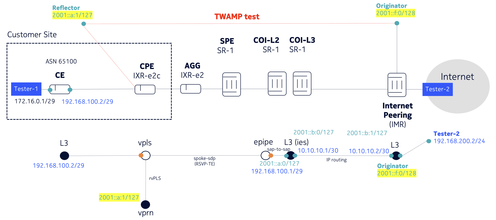

# Nokia TWAMP Test Lab with Containerlab

This is a Nokia lab demonstrating TWAMP (Two-Way Active Measurement Protocol) testing between network devices using Nokia SR OS simulators. The lab includes a complete network topology with TWAMP originator and reflector endpoints for performance measurement testing.



## Overview

The lab implements a TWAMP test scenario where:
- **Originator**: Peering Router (7750 SR-1) initiates TWAMP tests
- **CPE (Reflector)**: Nokia IXR-e2c device that reflects TWAMP packets back to the originator
- **Network Path**: Complete L2/L3 network infrastructure between originator and CPE

The TWAMP session measures round-trip delay and packet loss between the originator (172.20.20.107) and CPE endpoints through a realistic network topology including aggregation, service provider edge, and core networking elements.

## Lab Components

### Network Devices
- **ce**: Customer Edge (Nokia IXR-e2c)
- **cpe**: Customer Premises Equipment (Nokia IXR-e2c) - TWAMP Reflector
- **agg**: Aggregation Router (Nokia IXR-e2)
- **spe**: Service Provider Edge (Nokia SR-1)
- **coi-l2**: Core of Internet L2 (Nokia SR-1)
- **coi-l3**: Core of Internet L3 (Nokia SR-1)
- **peering**: Peering Router (Nokia SR-1) - TWAMP Originator

### Test Endpoints
- **tester1**: Linux host (172.16.0.2) connected to CE
- **tester2**: Linux host (192.168.200.2) connected to peering router

## Getting Started

### Prerequisites
- Containerlab installed
- Nokia SROS license file available
- Docker with Nokia SR OS simulator images

### Deployment

1. **Deploy the topology:**
   ```bash
   sudo containerlab deploy -t topo.clab.yml
   ```

2. **Verify deployment:**
   ```bash
   sudo containerlab inspect -t topo.clab.yml
   ```

**Note:** Make sure you have updated/uploaded the Nokia SROS License File in the location specified in the license section of the topology file (`../license-srsim25.txt`).

## TWAMP Configuration

### TWAMP Session Details
- **Session Name**: `toCPE`
- **Test Direction**: Peering Router (172.20.20.107) → CPE (172.20.20.102)
- **Source Address**: `2001::f:0` (Originator)
- **Destination Address**: `2001::a:1` (CPE Reflector)
- **UDP Port**: 64364
- **Test ID**: 100708
- **Interval**: 1 seconds (1000ms)
- **Pad Size**: 5 bytes
- **Measurement Interval**: 5 minutes
- **Statistics**: log to accounting file but also available via Streaming Telemetry

### Key Configuration Elements

#### Originator Configuration
- TWAMP-Light reflector enabled on originator device
- OAM-PM session configured with delay measurement template
- IPv6 addressing for TWAMP endpoints

#### CPE Reflector Configuration  
- TWAMP-Light reflector service configured
- Accepts TWAMP tests from originator prefix range
- VPRN service for TWAMP traffic isolation with static route and rVPLS to L2 service

## Performance Monitoring

### Collecting TWAMP Statistics

To retrieve the average round-trip delay from the TWAMP test session, use the provided script:

```bash
./gnmic_twamp.sh
```

This script uses gNMI to subscribe to TWAMP statistics and extracts the average delay measurement from the originator device.

**Manual gNMI Command:**

First, we get the latest interval-number
```bash
$ gnmic -a 172.20.20.107 -u grpc -p telemetry --insecure get --format flat --path "/state/oam-pm/session[session-name=toCPE]/ip/twamp-light/statistics/delay/measurement-interval[duration=5-mins]/newest-index"

state/oam-pm/session[session-name=toCPE]/ip/twamp-light/statistics/delay/measurement-interval[duration=5-mins]/newest-index: 14

$completed=13
```

For Streaming Telemetry, we choose the previous interval-number that was completed.
```bash
gnmic -a 172.20.20.107 -u grpc -p telemetry --insecure subscribe --format flat --path "/state/oam-pm/session[session-name=toCPE]/ip/twamp-light/statistics/delay/measurement-interval[duration=5-mins]/number[mi-number=$completed]/bin-type[bin-metric=fd]/round-trip/average"

state/oam-pm/session[session-name=toCPE]/ip/twamp-light/statistics/delay/measurement-interval[duration=5-mins]/number[mi-number=13]/bin-type[bin-metric=fd]/round-trip/average: 9735
```

### Available Metrics
- Round-trip delay (average, minimum, maximum)
- Forward and backward delay measurements
- Packet loss statistics
- Jitter measurements
- Streaming telemetry data

## Network Architecture

The lab implements a realistic service provider network with:
- **Access Layer**: CE and CPE devices
- **Aggregation Layer**: AGG router with MPLS connectivity
- **Core Layer**: SPE and COI routers providing L2/L3 services
- **Peering Layer**: External connectivity simulation

### Protocol Stack
- **L2**: Ethernet, VLAN (802.1Q)
- **L3**: IPv4/IPv6, ISIS, MPLS
- **Services**: VPRN, EPIPE
- **OAM**: TWAMP-Light for performance measurement

## File Structure

```
twamp_coi/
├── topo.clab.yml              # Main topology definition
├── topology.png               # Network diagram
├── gnmic_twamp.sh             # TWAMP statistics collection script
├── save_config.sh             # Configuration backup script
├── startup_config/            # Device startup configurations
│   ├── peering.partial.txt    # TWAMP originator config
│   ├── cpe.partial.txt        # TWAMP reflector config
│   └── *.partial.txt          # Other device 
```

## Troubleshooting

### Common Issues

1. **License File Missing**: Ensure Nokia SROS license is available at the specified path
2. **Port Conflicts**: Check if management ports (172.20.20.x) are available
3. **TWAMP Session Down**: Verify IPv6 connectivity between originator and CPE
4. **gNMI Connection Issues**: Confirm grpc user credentials and device accessibility

### Verification Commands

**Check TWAMP session status on originator:**
Make sure to choose the latest completed interval, in this example interval-number is 2 and the latest in-progress is always 1.
```bash
ssh admin@originator

A:admin@peering# /show oam-pm statistics session "toCPE" twamp-light meas-interval 5-mins interval-number 2

------------------------------------------------------------------------------
Start (UTC)       : 2025/09/11 19:50:00          Status          : completed
Elapsed (seconds) : 300                          Suspect         : no
Frames Sent       : 300                          Frames Received : 300
------------------------------------------------------------------------------
===============================================================================
TWAMP-LIGHT DELAY STATISTICS

----------------------------------------------------------------------------
Bin Type     Direction     Minimum (us)   Maximum (us)   Average (us)   EfA
----------------------------------------------------------------------------
FD           Forward               3815           7802           5373    no
FD           Backward              3366           7325           4362    no
FD           Round Trip            7181          12620           9735    no
FDR          Forward                  0           3987           1498    no
FDR          Backward                 0           3959            980    no
FDR          Round Trip               0           5439           2345    no
IFDV         Forward                  4           2741            516    no
IFDV         Backward                 6           3801            447    no
IFDV         Round Trip              13           3518            779    no
----------------------------------------------------------------------------
EfA = yes: one or more bins configured to be Excluded from the Average calc.

---------------------------------------------------------------
Frame Delay (FD) Bin Counts
---------------------------------------------------------------
Bin      Lower Bound       Forward      Backward    Round Trip
---------------------------------------------------------------
0               0 us             0             0             0
1            2000 us             1            47             0
2            4000 us           269           250             0
3            6000 us            30             3             1
4            8000 us             0             0           209
5           10000 us             0             0            90
---------------------------------------------------------------

---------------------------------------------------------------
Frame Delay Range (FDR) Bin Counts
---------------------------------------------------------------
Bin      Lower Bound       Forward      Backward    Round Trip
---------------------------------------------------------------
0               0 us           258           294            99
1            2000 us            42             6           192
2            4000 us             0             0             9
3            6000 us             0             0             0
4            8000 us             0             0             0
5           10000 us             0             0             0
---------------------------------------------------------------

---------------------------------------------------------------
Inter-Frame Delay Variation (IFDV) Bin Counts
---------------------------------------------------------------
Bin      Lower Bound       Forward      Backward    Round Trip
---------------------------------------------------------------
0               0 us           295           294           281
1            2000 us             5             6            19
2            4000 us             0             0             0
3            6000 us             0             0             0
4            8000 us             0             0             0
5           10000 us             0             0             0
---------------------------------------------------------------
===============================================================================
===============================================================================
TWAMP-LIGHT LOSS STATISTICS: NONE
===============================================================================
```

**Verify TWAMP reflector on CPE:**
```bash
ssh admin@cpe
A:admin@cpe# show router service-name twamp twamp-light 

-------------------------------------------------------------------------------
TWAMP-Light Reflector
-------------------------------------------------------------------------------
Admin State          : Up                      UDP Port         : 64364
IPv6 UDP Checksum 0  : Disallow                
Description          : (Not Specified)
Up Time              : 0d 00:13:27             
Test Frames Received : 667                     Test Frames Sent : 667
Type                 : TWAMP-Light             
-------------------------------------------------------------------------------

-------------------------------------------------------------------------------
TWAMP-Light Reflector Prefixes
-------------------------------------------------------------------------------
Prefix                                      Description
-------------------------------------------------------------------------------
2001::f:0/127                               
-------------------------------------------------------------------------------
No. of TWAMP-Light Reflector Prefixes: 1
-------------------------------------------------------------------------------
```

**Test network connectivity:**
IPv6 ping from Peering to CPE
```bash
ssh admin@originator
A:admin@peering# ping 2001::a:1 source-address 2001::f:0
PING 2001::a:1 56 data bytes
64 bytes from 2001::a:1 icmp_seq=1 hlim=63 time=8.96ms.
64 bytes from 2001::a:1 icmp_seq=2 hlim=63 time=9.36ms.
64 bytes from 2001::a:1 icmp_seq=3 hlim=63 time=10.2ms.
64 bytes from 2001::a:1 icmp_seq=4 hlim=63 time=9.09ms.
64 bytes from 2001::a:1 icmp_seq=5 hlim=63 time=9.38ms.

---- 2001::a:1 PING Statistics ----
5 packets transmitted, 5 packets received, 0.00% packet loss
round-trip min = 8.96ms, avg = 9.39ms, max = 10.2ms, stddev = 0.416ms
```

## Save configurations

To save additional changes to the topology, make sure to run script below which will copy all config.cfg files to the ./config directory.
```bash
./save_config.sh
```

## Cleanup

To destroy the lab:
```bash
sudo containerlab destroy -t topo.clab.yml
```
